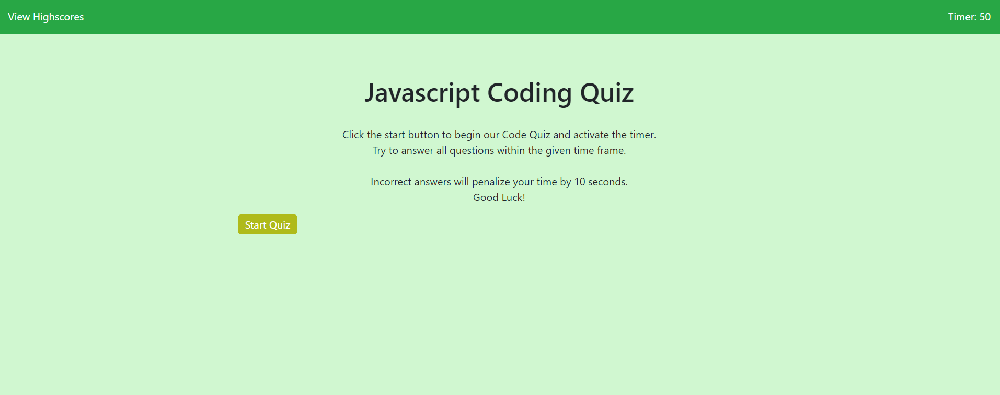
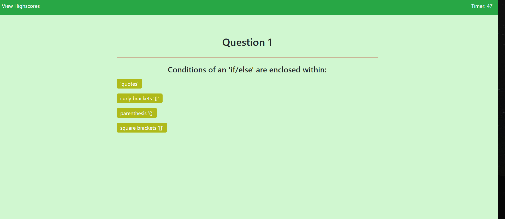
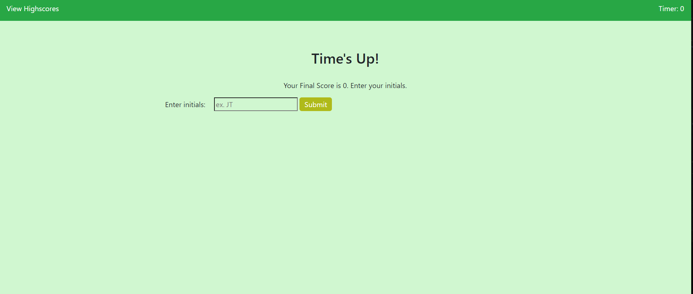

# Javascript Code Quiz

## Project Description

This project was designed to build a Javascript code quiz and learn out way around applying data from a web page and storing it locally in the DOM.  This project was a bit challenging for me in terms of laying out functionality and methods for the page.  Nonetheless it was a great learning experience.  Some last minute boot camp lessons on bootstrap came in handy in the pinch to help me quickly with layouts and design.  I know the look is still a bit rudamentary do to the bulk of my time on this project being dedicated to the javascript.  

## Installation
Use any bowser to visit https://mcnultyshane.github.io/code_quiz/ in order to view the project.

## Usage
When visiting the website you will see a naviagation bar in the top that houses the link to the stored high scores as well as the timer that will decrease until time is finished.  
 
Clicking the Start button will begin the quiz, as well as the clock.

The scores (albeit not very large right now) will bestored in local storage using JSON stringify and JSON Parse.
 

## Credits
Credits to the Penn Coding Bootcamp Staff and to MIT.

## License

For Bootstrap:
The MIT License (MIT)

Copyright (c) 2011-2021 Twitter, Inc.
Copyright (c) 2011-2021 The Bootstrap Authors

Permission is hereby granted, free of charge, to any person obtaining a copy
of this software and associated documentation files (the "Software"), to deal
in the Software without restriction, including without limitation the rights
to use, copy, modify, merge, publish, distribute, sublicense, and/or sell
copies of the Software, and to permit persons to whom the Software is
furnished to do so, subject to the following conditions:

The above copyright notice and this permission notice shall be included in
all copies or substantial portions of the Software.

THE SOFTWARE IS PROVIDED "AS IS", WITHOUT WARRANTY OF ANY KIND, EXPRESS OR
IMPLIED, INCLUDING BUT NOT LIMITED TO THE WARRANTIES OF MERCHANTABILITY,
FITNESS FOR A PARTICULAR PURPOSE AND NONINFRINGEMENT. IN NO EVENT SHALL THE
AUTHORS OR COPYRIGHT HOLDERS BE LIABLE FOR ANY CLAIM, DAMAGES OR OTHER
LIABILITY, WHETHER IN AN ACTION OF CONTRACT, TORT OR OTHERWISE, ARISING FROM,
OUT OF OR IN CONNECTION WITH THE SOFTWARE OR THE USE OR OTHER DEALINGS IN
THE SOFTWARE.
## Badges
Non-applicable.

## Features
Non-applicable.

## How to Contribute
Non-applicable.

## Tests
Non-applicable.
